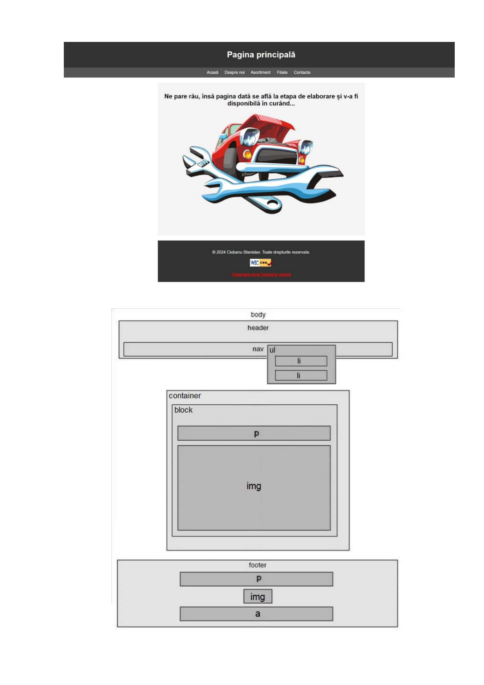
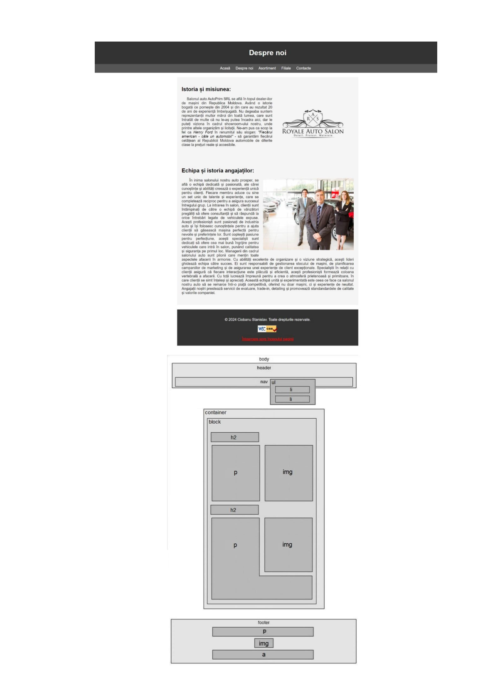
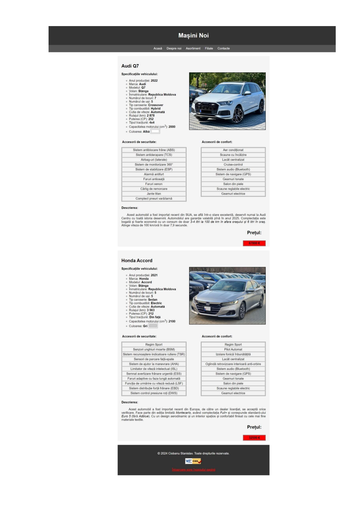
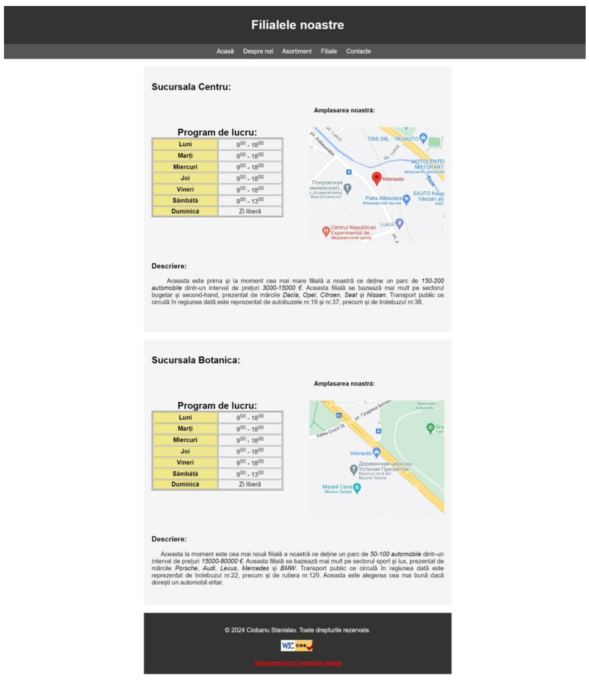

# Laboratory Work No.1 — Web Technologies

**Student:** Ciobanu Stanislav, group CR-221fr  
**Supervisor:** Lect. Univ. Rusu Viorel  
**Institution:** Technical University of Moldova — Faculty of Computers, Informatics and Microelectronics  
**Year:** 2024

---

## Assignment

> **Designing a Web Application. Creating Web Content using HTML and CSS**

---

## Description

The project consists of two main parts:

1. **Local web server setup** — comparison of packages (XAMPP, WAMP, EasyPHP, AMPPS, AppServ), selection and installation of **XAMPP**, configuration of virtual hosts, testing with simple HTML/CSS pages.

2. **Static website development** — a fictional car dealership website **AutoPrim SRL** with 5 interconnected HTML pages, a shared CSS file, dropdown menus, dynamic blocks, tables, and forms.

---

## Project Structure

```
autoprim/
├── style.css # Shared CSS file for all pages
├── index.html # Homepage
├── despre.html # "About Us" page
├── masini_noi.html # "Assortment → New Cars" page
├── masini_second_hand.html # "Assortment → Used Cars" page
├── filiale.html # "Branches" page
└── contacte.html # "Contacts" page

exemplu/
├── index.html # Web server test page
└── style.css # Test page styles
```

---

## Website Functional Model

```
Home
├── Home
├── About Us
├── Assortment
│ ├── New Cars
│ └── Used Cars
├── Branches
└── Contacts
```

---

## Technologies Used

| Technology | Version / Details |
|---|---|
| HTML | HTML5 |
| CSS | CSS3 + SVG (W3C validated) |
| Web Server | Apache (via XAMPP 8.2.12) |
| Browser | Microsoft Edge |
| Editor | Notepad |
| Image hosting | imgbb.com (CDN) |
| Maps | Google Maps embed |

---

## Screenshots

### Homepage — AutoPrim SRL (`index.html`)



---

### "About Us" Page (`despre.html`)



---

### "New Cars" Page (`masini_noi.html`)



---

### "Our Branches" Page (`filiale.html`)



---

## HTML/CSS Features Demonstrated

- Semantic HTML5 structure: `<header>`, `<nav>`, `<footer>`, `<section>`
- Navigation menu with **dropdown submenu** (CSS `:hover`)
- **Tables** using `border`, `colspan`, `rowspan`, `caption`, `bgcolor`
- **Forms** with `input[type="email|tel|date|color|submit"]`
- **HTML5 Canvas** with JavaScript (drawing, text, shadows, gradients)
- **HTML5 Audio** with `autoplay` and `loop` attributes
- **Lists** ordered and unordered (`<ol type="A">`, `<ul type="circle">`)
- Text formatting: `<b>`, `<i>`, `<u>`, `<em>`, `<strong>`, `<cite>`, `<code>`, `<pre>`, `<sup>`
- HTML entities: `&copy;`, `&nbsp;`, `&lt;`, `&gt;`, `&amp;`
- Internal anchors (`<a name="...">`) and external links
- External CSS with simple, multiple, descendant, attribute selectors and pseudo-classes
- CSS classes for dynamic blocks with fixed height
- External images via CDN (imgbb.com)
- Embedded Google Maps (`<iframe>`)
- Validated with **W3C CSS Validator** (CSS3 + SVG — no errors)
- Validated with **W3C Markup Validation Service** (HTML5 — no errors)

---

## Local Setup

1. Install [XAMPP](https://www.apachefriends.org/) and start the **Apache** module.  
2. Copy the `autoprim/` folder into `C:\xampp\htdocs\`.  
3. Open in browser: `http://localhost/autoprim/`

---

## Conclusion

This project provided practical experience with setting up a local web server (XAMPP), creating and validating HTML5/CSS3 pages, configuring Apache virtual hosts, and implementing a multi-page static website with functional navigation.

---

*© 2024 Ciobanu Stanislav. All rights reserved.*
